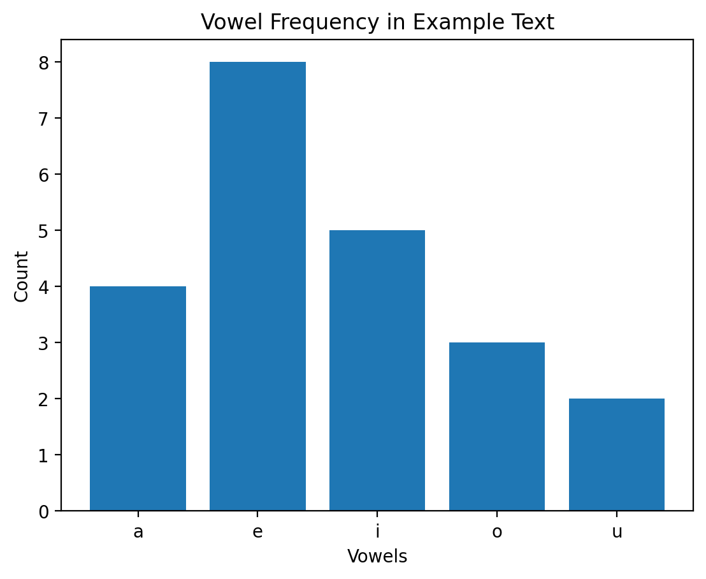

# 🔤 Phonetics Vowel Counter  

A simple Python project to analyse **vowel frequency** in text and visualise results using **matplotlib**.  
Created by **Nadia Safeer** 👩‍💻  

---

## ✨ Features
- Counts vowels (a, e, i, o, u) in any input text  
- Displays results as a bar chart  
- Easy to run in **Google Colab** or locally with Python  

---

## 🚀 Run in Google Colab
Click below to open and run directly in Colab:  
[](https://colab.research.google.com/github/Nadiya-safeer11/phonetics-vowel-counter/blob/main/vowel_counter.ipynb)


---

## 🛠 How to Use (Local)
1. Clone the repository:
   ```bash
   git clone https://github.com/Nadiya-safeer11/phonetics-vowel-counter.git

   ## 📄 License
This project is licensed under the **MIT License** – you are free to use, modify, and distribute it, provided proper credit is given.  

See the [LICENSE](LICENSE) file for more details.

cd phonetics-vowel-counter
python vowel_counter.py

 
 


